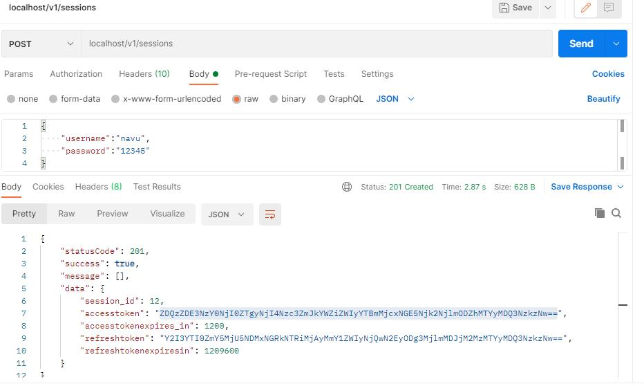
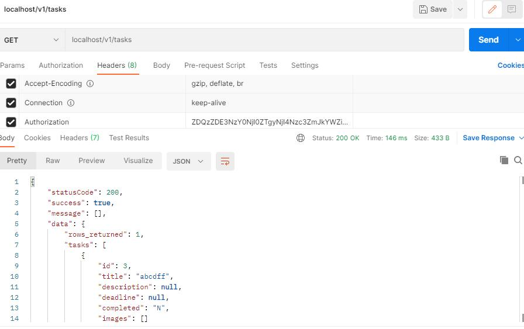
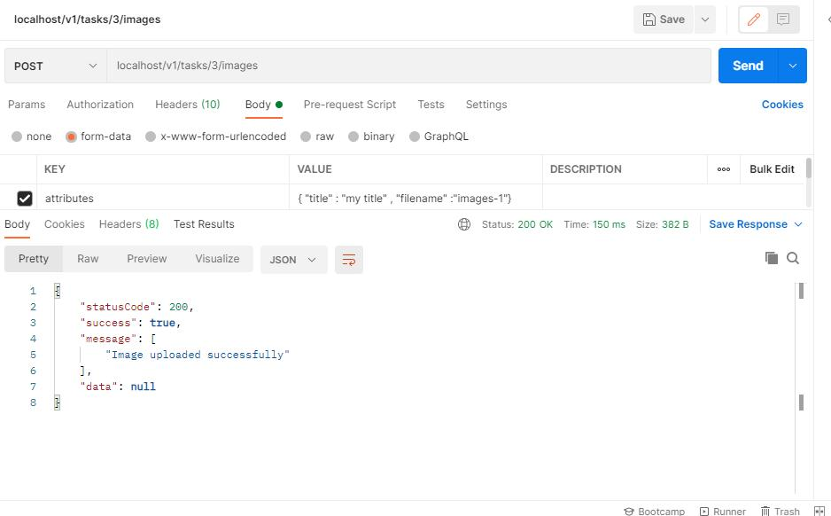
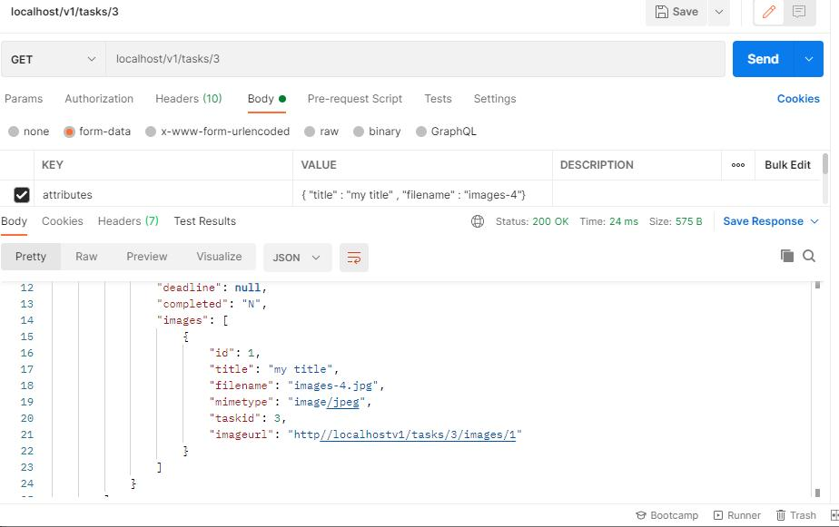

# REST API - User - Task - Image Manager

## This REST API build on core-php supports user management with their associated task and images via Standard Http methods with proper error response and authentication method

### Key Features in this project :
    1) OOPS
    2) Login System with Sessions Handling and auth-token
    3) Upload Images
    4) User Management

#### Login 

#### Enlist Tasks 

#### POST Images particular to task and user_id 

#### GET Images particular to task and user_id 

#### **Task and Images both supports GET, POST, PATCH, DELETE Operations to view and modify items 

